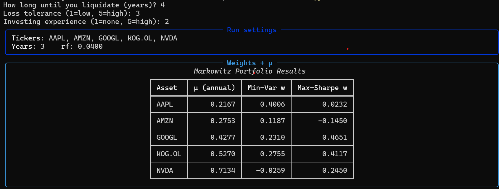
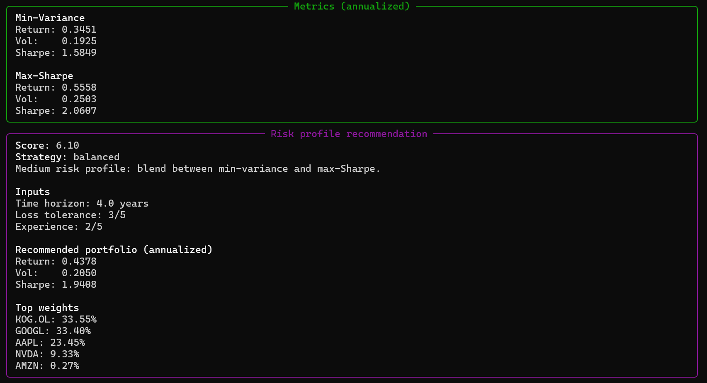

# Markowitz Portifolio Optimization

## Introduction

This project implements an end-to-end framework for Markowitz Mean–Variance Portfolio Optimization, combining financial theory with practical data analysis.

Using historical price data, the model:
- Retrieves and cleans asset price series
- Computes returns, expected returns, and the covariance matrix
- Constructs the minimum-variance and maximum-Sharpe portfolios
- Evaluates portfolio performance (return, volatility, Sharpe ratio)
- Selects an appropriate strategy based on a rule-based risk profiling model
- Visualizes results through an interactive dashboard and efficient frontier plot
- The implementation bridges mathematical theory and applied quantitative finance, providing a transparent and intuitive tool for portfolio construction and risk assessment

## Author
- Ragnhild Thielemann
- BSc in Quantitative Finance | University of Oslo
- Email: ragnhild.thi@gmail.com

# Demo: 

# The mathematics

## Expected return

Let $r_{i,t}$ denote the return of asset $i$ at time $t$.
The expected return is defined as

$$
    E[r_i]
$$

Since $E[r_i]$ is unknown, we estimate it from historical data using the sample mean

$$
    \bar{r}_i
    =
    \frac{1}{T}\sum_{t=1}^{T} r_{i,t}
$$

For daily data, the annualized expected return is

$$
    \mu_i
    =
    252\,\bar{r}_i
    =
    252\cdot\frac{1}{T}\sum_{t=1}^{T} r_{i,t}
$$

## Covariance matrix

Let $r_{i,t}$ and $r_{j,t}$ denote the returns of assets $i$ and $j$ at time $t$.  
The covariance between assets $i$ and $j$ at time $t$ is defined as

$$
    \Sigma_{ij}
    =
    E\\left[(r_i - E[r_i])(r_j - E[r_j])\right]
$$

If both returns are simultaneously above their respective expected values (positive deviations) or simultaneously below them (negative deviations), the product term is positive and the covariance is therefore positive, indicating that the assets tend to move together. Conversely, if one return is above its mean while the other is below its mean, the product term becomes negative, resulting in negative covariance, which indicates that the assets tend to move in opposite directions.

When $i = j$, the covariance reduces to the variance of asset $i$, denoted

$$
\Sigma_{ii} = \sigma_i^2,
$$

which measures the volatility of that asset. In practice, the covariance between two distinct assets is typically smaller in magnitude than the variance of each asset individually, since variance measures the dispersion of a return series with itself, whereas covariance captures only the degree of co-movement between two different assets.

Since the true covariance is unknown, it is estimated from historical data as

$$
    \hat{\Sigma}_{ij}
    =
    \frac{1}{T-1}
    \sum_{t=1}^{T}
    (r_{i,t} - \bar{r}_i)(r_{j,t} - \bar{r}_j)
$$

where $T$ is the number of observations and $\bar{r}$ is the vector of sample mean returns.
Collecting all covariances yields the covariance matrix

$$
    \boldsymbol{\Sigma}
    =
    \begin{pmatrix}
    \Sigma_{11} & \Sigma_{12} & \cdots & \Sigma_{1N} \\
    \Sigma_{21} & \Sigma_{22} & \cdots & \Sigma_{2N} \\
    \vdots      & \vdots      & \ddots & \vdots      \\
    \Sigma_{N1} & \Sigma_{N2} & \cdots & \Sigma_{NN}
    \end{pmatrix}
$$

## Portfolio expected return

Here, **$\mathbf{w} = (w_1, \dots, w_N)^\top$** and **$\boldsymbol{\mu} = (\mu_1, \dots, \mu_N)^\top$** are column vectors representing the portfolio weights and the expected returns of the individual assets, respectively, so the expected portfolio return

$$
E[r_p] = \mathbf{w}^\top \boldsymbol{\mu} = \sum_{i=1}^{N} w_i \mu_i
$$

is computed as their **dot product**, which is equivalent to the weighted sum of the individual expected returns.
    

## Portfolio variance and volatility

The **variance** of the portfolio return measures how much the portfolio's returns fluctuate around its expected return. If we denote the portfolio weights by **$\mathbf{w} = (w_1, \dots, w_N)^\top$** and the covariance matrix of asset returns by **$\boldsymbol{\Sigma}$**, the portfolio variance is given by

$$
\mathrm{Var}(r_p) = \mathbf{w}^\top \boldsymbol{\Sigma} \mathbf{w}
$$

This formula is a **quadratic form**, which accounts for both the variances of the individual assets and their covariances. Intuitively, it shows that the portfolio variance depends not only on how risky each asset is but also on how the assets move together.

The **portfolio volatility** (or standard deviation) is the square root of the variance:

$$
\sigma_p = \sqrt{\mathbf{w}^\top \boldsymbol{\Sigma} \mathbf{w}}
$$

Volatility is a commonly used measure of portfolio risk because it expresses the expected fluctuation of returns in the same units as the returns themselves. Lower volatility implies a more stable portfolio, while higher volatility implies greater risk.
## Sharpe ratio

Let **$r_f$** denote the **risk-free rate**, which is the return an investor can earn without taking any risk (for example, from government bonds).

The **Sharpe ratio** of a portfolio measures the **risk-adjusted return** — how much excess return the portfolio provides per unit of risk. It is defined as

$$
\mathrm{SR} = \frac{E[r_p] - r_f}{\sigma_p} = \frac{\mathbf{w}^\top \boldsymbol{\mu} - r_f}{\sqrt{\mathbf{w}^\top \boldsymbol{\Sigma} \mathbf{w}}}
$$

- **$E[r_p] - r_f$** is the **excess expected return** over the risk-free rate.  
- **$\sigma_p = \sqrt{\mathbf{w}^\top \boldsymbol{\Sigma} \mathbf{w}}$** is the **portfolio volatility** (standard deviation of returns).  

Intuitively, the Sharpe ratio answers the question:

> "For each unit of risk I take, how much extra return do I expect to earn above a risk-free investment?"

A **higher Sharpe ratio** indicates a better risk-adjusted performance, meaning the portfolio is expected to generate more return for each unit of risk taken. Conversely, a **low or negative Sharpe ratio** suggests that the portfolio’s returns may not justify its risk.

## Markowitz Mean–Variance Optimization

Given the expected returns **$\boldsymbol{\mu}$** and the covariance matrix **$\boldsymbol{\Sigma}$**, the classical **Markowitz portfolio optimization** problem aims to **minimize portfolio risk** for a given target return:

$$
\min_{\mathbf{w}} \ \mathbf{w}^\top \boldsymbol{\Sigma} \mathbf{w} 
\quad \text{subject to} \quad 
\mathbf{w}^\top \boldsymbol{\mu} = \mu_{\text{target}}, 
\quad \sum_{i=1}^{N} w_i = 1
$$

- **Objective:** Minimize portfolio variance (risk).  
- **Constraint 1:** Achieve a target expected return $\mu_{\text{target}}$.  
- **Constraint 2:** Fully invest the portfolio ($\sum_i w_i = 1$).  

### Lagrange Function for Portfolio Optimization

The Lagrange function for the Markowitz portfolio problem is:

$\mathcal{L}(w, \lambda, \gamma) = w^\top \Sigma w - \lambda (w^\top \mu - \mu_{\text{target}}) - \gamma \left(\sum_{i=1}^{N} w_i - 1\right)$

To find the optimal portfolio weights, we take the derivatives of $\mathcal{L}$ with respect to $w$, $\lambda$, and $\gamma$, and set them equal to zero:

- $\frac{\partial \mathcal{L}}{\partial w} = 2\Sigma w - \lambda \mu - \gamma \mathbf{1} = 0$  
- $\frac{\partial \mathcal{L}}{\partial \lambda} = -(w^\top \mu - \mu_{\text{target}}) = 0$  
- $\frac{\partial \mathcal{L}}{\partial \gamma} = -\left(\sum_{i=1}^{N} w_i - 1\right) = 0$

Solving this system yields the optimal weights $w^\*$ that satisfy both the target return and the full‑investment constraint.

## Risk profiling model

We use a simple **heuristic risk profiling model** to map user preferences to a portfolio choice
along the efficient frontier.

Let the user provide the following inputs:

- Investment horizon (years): $T$
- Loss tolerance (integer scale): $L \in \{1,2,3,4,5\}$
- Investment experience (integer scale): $E \in \{1,2,3,4,5\}$

---

### Normalization

The investment horizon is capped and normalized to the interval $[0,1]$:

$$
    \tilde{T}
    =
    \frac{\min(T, 10)}{10}
$$

This prevents excessively long horizons from dominating the score.

---

### Risk score

The overall risk score is defined as a weighted sum:

$$
    S
    =
    4 \cdot \tilde{T}
    +
    1.1 \cdot L
    +
    0.6 \cdot E
$$

The coefficients are design parameters reflecting the relative importance of
time horizon, loss tolerance, and experience.

The resulting score typically lies in the interval:

$$
    S \in [0, 10]
$$

---

### Strategy selection

The risk score is mapped to a portfolio strategy using fixed thresholds:

$$
    \text{Strategy}(S)
    =
    \begin{cases}
    \text{Minimum Variance}, & S < 5.0 \\
    \text{Balanced}, & 5.0 \le S < 7.5 \\
    \text{Maximum Sharpe}, & S \ge 7.5
    \end{cases}
$$

### Balanced portfolio

For intermediate risk scores, a **balanced portfolio** is constructed as a convex
combination of the minimum-variance portfolio $w_{\min}$ and the maximum-Sharpe
portfolio $w_{\tan}$.

Define the interpolation parameter:

$$
    \alpha
    =
    \frac{S - 5.0}{7.5 - 5.0}
    \quad \text{with} \quad \alpha \in [0,1]
$$

The resulting portfolio weights are:

$$
    w
    =
    (1 - \alpha)\ w_{\min}
    +
    \alpha\ w_{\tan}
$$

Finally, the weights are normalized such that:

$$
    \sum_{i=1}^N w_i = 1
$$

---

This risk profiling model is heuristic and rule-based.
It does not rely on CAPM or utility maximization, but provides an intuitive
and transparent method for selecting a portfolio along the efficient frontier.

#### list of some tickers from yfinance:

	•	DNB: DNB.OL
	•	Telenor: TEL.OL
	•	Norsk Hydro: NHY.OL
	•	Yara International: YAR.OL
	•	Aker BP: AKRBP.OL
	•	Subsea 7: SUBC.OL
	•	Vår Energi: VAR.OL
	•	Kongsberg Gruppen: KOG.OL
	•	Mowi: MOWI.OL
	•	SalMar: SALM.OL
	•	Orkla: ORK.OL
	•	Gjensidige: GJF.OL
	•	Storebrand: STB.OL
	•	Apple: AAPL
	•	Microsoft: MSFT
	•	Alphabet: GOOGL
	•	Amazon: AMZN
	•	NVIDIA: NVDA
	•	Meta Platforms: META
	•	JPMorgan Chase: JPM
	•	Bank of America: BAC
	•	Goldman Sachs: GS
	•	Tesla: TSLA
	•	Coca-Cola: KO
	•	Procter & Gamble: PG
	•	Walmart: WMT
	•	Johnson & Johnson: JNJ
	•	Exxon Mobil: XOM
	•	Chevron: CVX

#### Note to self: 
bash: conda activate markowitz

